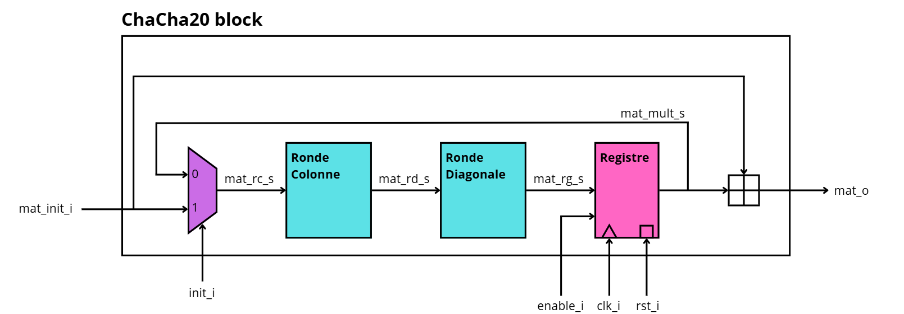
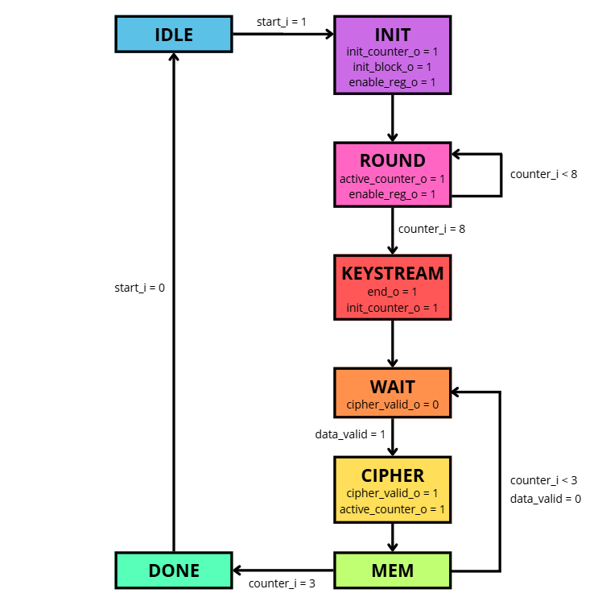
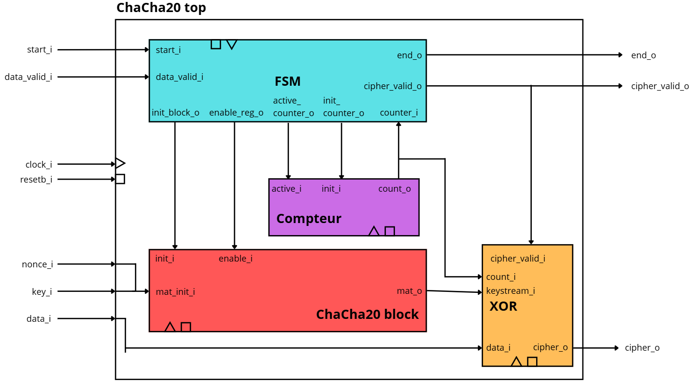
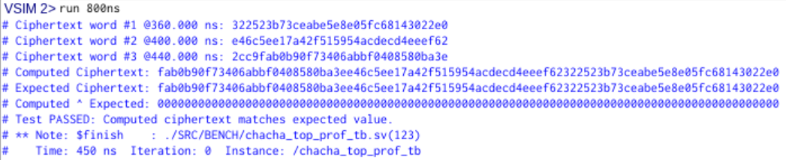

# ChaCha20 Hardware Implementation with SystemVerilog

A complete hardware implementation of the ChaCha20 stream cipher in SystemVerilog, built bottom-up from the elementary ARX primitive to a fully integrated encryption module, validated through simulation at every stage.

> **Academic project** — Digital System Design (CSN), Mines Saint-Étienne (ISMIN), 2025–2026

---

## Overview

ChaCha20 is a stream cipher that generates a pseudo-random keystream, later XORed with plaintext to produce ciphertext. This project implements the full algorithm with 20 rounds (10 column rounds + 10 diagonal rounds) operating on a 512-bit internal state as a synthesizable RTL design, plus the surrounding control logic (FSM, counter, XOR encryption stage) needed to encrypt a full message.

The design was built and validated hierarchically: each module was simulated against reference test vectors before being integrated into the next level, which made debugging straightforward at each stage.

```
ARX (add-rotate-xor)
  → QuarterRound (4x ARX chained)
    → Column Round / Diagonal Round (4x QuarterRound in parallel)
      → ChaCha20 Block (10 rounds, iterative with feedback register)
        → ChaCha_top (Block + FSM + Counter + XOR cipher stage)
```

---

## Architecture

### ARX primitive
The elementary building block: `sum = augend + addend`, then `shift = ROL(sum XOR xor_in, n)`. Implemented as 4 parametrized instances (ARX7, ARX8, ARX12, ARX16) differing only by rotation amount.

### QuarterRound
Chains 4 ARX modules combinatorially (a full QuarterRound executes in a single clock cycle once integrated into a round).

### Column / Diagonal Round
Each round applies 4 QuarterRounds in parallel on different word groupings of the 4×4 state matrix (columns vs. shifted diagonals), enabling a full round per clock cycle.

### ChaCha20 Block
Rather than instantiating 20 rounds combinatorially (too costly in hardware), the design uses an **iterative architecture with a feedback register**: a column round + diagonal round pair is computed combinatorially each cycle, and a 512-bit register stores the intermediate state, looping back through a 2:1 multiplexer for 10 cycles. A final word-wise adder combines the result with the initial state to produce the keystream.



### Control FSM
A Moore-type finite state machine orchestrates the whole system in two phases:
- **Keystream generation**: `IDLE → INIT → ROUND (×10) → KEYSTREAM`
- **Message encryption**: `WAIT → CIPHER → MEM`, repeated for each of the 3 message blocks, then `DONE`



### Top-level integration (`chacha_top`)
Connects the FSM, a shared round counter, the ChaCha20 Block, and the XOR cipher stage. The XOR module selects the correct 128-bit keystream slice per block (via a 3:1 mux) and registers the ciphertext output, gated by `cipher_valid_i`.



---

## Validation

Every module was validated against test vectors before integration:

| Module | Validation method |
|---|---|
| ARX | Manual comparison against reference vectors from the assignment |
| QuarterRound | Manual comparison against reference vectors |
| Column / Diagonal Round | Manual comparison against Round 0 reference matrices |
| ChaCha20 Block | Manual comparison against intermediate round states + final keystream |
| FSM | Dedicated testbench (`chacha_fsm_tb.sv`) covering 3 scenarios: nominal operation, immediate `data_valid`, and asynchronous reset mid-computation |
| **chacha_top (full system)** | **Automated** comparison against reference ciphertext using the instructor's testbench (`chacha_top_prof_tb.sv`) (bitwise XOR against expected output, result: **Test PASSED**) |



The full system was validated end-to-end: given a known key, nonce, and 3 plaintext blocks, the computed ciphertext matches the reference values exactly.

---

## Design notes & debugging

A few non-trivial issues surfaced during development and are documented in detail in the full report:
- An off-by-one in the round counter (`counter_i == 9` instead of `8`) caused 11 rounds to be computed instead of 10, due to the one-cycle latency between counter increment and round completion.
- The output XOR register was initially purely combinational; re-reading the specification revealed it had to be a clocked register gated by `cipher_valid_i`, which was then added to comply with the spec.
- The instructor's testbench samples signals on the falling edge, requiring an extra clock cycle after `cipher_valid_o` goes high before `cipher_o` could be read reliably.

---

## Repository Structure

```
chacha20-verilog/
├── SRC/
│   ├── RTL/               # SystemVerilog source modules
│   └── BENCH/             # Testbenches (_tb.sv)
├── docs/
│   ├── project_report.pdf
│   ├── fsm_graph.png
│   ├── architecture_block.png
│   ├── architecture_top.png
│   └── simulation_results.png
└── README.md
```

Naming convention: `_i` for inputs, `_o` for outputs, `_s` for internal signals.

---

## Built With

- SystemVerilog
- ModelSim (simulation)

---

## 📄 Full Report

A detailed **french report** covering every module's functional description, interface, internal architecture, and simulation validation is available in [`docs/project_report.pdf`](docs/Rapport_CSN.pdf).
